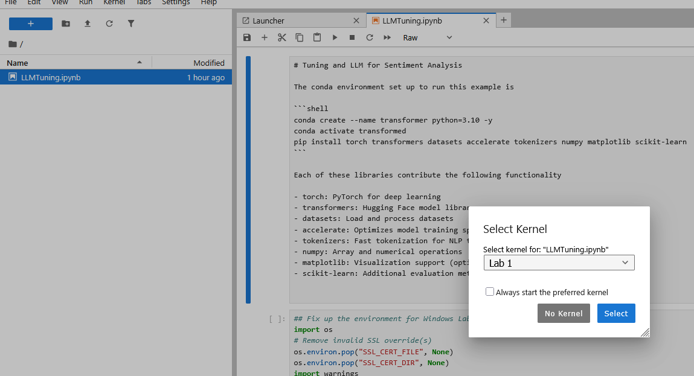

# Lab 1: Conda

In this version of the lab, you will be using the conda environment in the VM, although these instructions will work for any environment that has Anaconda installed.

## Step 1: Lab directory

Open the `Conda prompt` that is pinned to your task bar. Do not use a regular prompt since it doesn't have Anaconda on its path.

It will default to the `(base)` environment

In this shell, create the `lab1` directory and locate to it.

```bash
(base) C:\Users\micro>mkdir \lab1
(base) C:\Users\micro>cd \lab1
(base) C:\lab1>
```

## Step 2: Conda environment

You will create a lab conda environment called `transformer` where you will install all the tools necessary to train the transformer

First create the environment.

```bash
(base) C:\lab1>conda create --name transformer python=3.10 -y
Channels:
 - defaults
Platform: win-64
Collecting package metadata (repodata.json): done
Solving environment: done

## Package Plan ##

  environment location: C:\Users\micro\anaconda3\envs\transformer

  added / updated specs:
    - python=3.10
 --- output removed---
 Downloading and Extracting Packages:

Preparing transaction: done
Verifying transaction: done
Executing transaction: done
#
# To activate this environment, use
#
#     $ conda activate transformer
#
# To deactivate an active environment, use
#
#     $ conda deactivate
```

Deactivate the `base` environment and activate the `tranformer` environment.

```bash

(base) C:\lab1>conda deactivate

C:\lab1>conda activate transformer

(transformer) C:\lab1>
```

First, we need to install `pip`. In the example below, pip is already installed by you will need to install it on your VM environment.

```bash
(transformer) C:\lab1>conda install pip
Channels:
 - defaults
Platform: win-64
Collecting package metadata (repodata.json): done
Solving environment: done

# All requested packages already installed.

```

Now install all the tools you need for your lab.

```bash
(transformer) C:\lab1>pip install torch transformers datasets accelerate tokenizers numpy matplotlib scikit-learn

Collecting torch
  Using cached torch-2.10.0-cp310-cp310-win_amd64.whl.metadata (31 kB)
Collecting transformers
  Using cached transformers-5.2.0-py3-none-any.whl.metadata (32 kB)
Collecting datasets
  Using cached datasets-4.5.0-py3-none-any.whl.metadata (19 kB)
Collecting accelerate
  Using cached accelerate-1.12.0-py3-none-any.whl.metadata (19 kB)
  
  --- output removed ---
   
```

Optional sanity check, list the packages installed in the environment

```bash
(transformer) C:\lab1>pip list
Package            Version
------------------ -----------
accelerate         1.12.0
aiohappyeyeballs   2.6.1
aiohttp            3.13.3
aiosignal          1.4.0
annotated-doc      0.0.4
anyio              4.12.1
async-timeout      5.0.1
attrs              25.4.0
certifi            2026.1.4
charset-normalizer 3.4.4
click              8.3.1
colorama           0.4.6
contourpy          1.3.2
cycler             0.12.1
datasets           4.5.0
dill               0.4.0
exceptiongroup     1.3.1
filelock           3.24.3
fonttools          4.61.1
frozenlist         1.8.0
fsspec             2025.10.0
h11                0.16.0
hf-xet             1.2.0
httpcore           1.0.9
httpx              0.28.1
huggingface_hub    1.4.1
idna               3.11
Jinja2             3.1.6
joblib             1.5.3
kiwisolver         1.4.9
markdown-it-py     4.0.0
MarkupSafe         3.0.3
matplotlib         3.10.8
mdurl              0.1.2
mpmath             1.3.0
multidict          6.7.1
multiprocess       0.70.18
networkx           3.4.2
numpy              2.2.6
packaging          25.0
pandas             2.3.3
pillow             12.1.1
pip                26.0.1
propcache          0.4.1
psutil             7.2.2
pyarrow            23.0.1
Pygments           2.19.2
pyparsing          3.3.2
python-dateutil    2.9.0.post0
pytz               2025.2
PyYAML             6.0.3
regex              2026.2.19
requests           2.32.5
rich               14.3.3
safetensors        0.7.0
scikit-learn       1.7.2
scipy              1.15.3
setuptools         80.10.2
shellingham        1.5.4
six                1.17.0
sympy              1.14.0
threadpoolctl      3.6.0
tokenizers         0.22.2
torch              2.10.0
tqdm               4.67.3
transformers       5.2.0
typer              0.24.1
typer-slim         0.24.0
typing_extensions  4.15.0
tzdata             2025.3
urllib3            2.6.3
wheel              0.46.3
xxhash             3.6.0
yarl               1.22.0
```

## Step 3: Jupyter Lab

Now install Jupyter and register the kernel then start Jupyter lab. You should be redirected to the web page.

```bash
(transformer) C:\lab1>pip install jupyter
Collecting jupyter
  Using cached jupyter-1.1.1-py2.py3-none-any.whl.metadata (2.0 kB)
Collecting notebook (from jupyter)

--- output removed ---

(transformer) C:\lab1>python -m ipykernel install --user --name Transformer --display-name "Lab 1"
Installed kernelspec Transformer in C:\Users\micro\AppData\Roaming\jupyter\kernels\transformer

```

Clone the lab repository and copy the notebook `LLMTuning.ipynb` to the lab directory

```bash 
(transformer) C:\lab1>dir
 Volume in drive C has no label.
 Volume Serial Number is 86C5-C0A1

 Directory of C:\lab1

2026-02-23  03:30 PM    <DIR>          .
2026-02-23  03:30 PM    <DIR>          ..
2026-02-23  02:46 PM            17,185 LLMTuning.ipynb
               1 File(s)         17,185 bytes
               2 Dir(s)  83,361,484,800 bytes free
```

Now start the Jupyter lab

```bash

(transformer) C:\lab1>jupyter lab
[I 2026-02-23 15:58:02.394 ServerApp] jupyter_lsp | extension was successfully linked.
[I 2026-02-23 15:58:02.409 ServerApp] jupyter_server_terminals | extension was successfully linked.
[I 2026-02-23 15:58:02.409 ServerApp] jupyterlab | extension was successfully linked.
[I 2026-02-23 15:58:02.425 ServerApp] notebook | extension was successfully linked.
[I 2026-02-23 15:58:02.779 ServerApp] notebook_shim | extension was successfully linked.
[I 2026-02-23 15:58:02.794 ServerApp] notebook_shim | extension was successfully loaded.
```

## Step 4: In the lab

One the lab open, open the notebook and select "Lab 1" as the preferred kernel.




