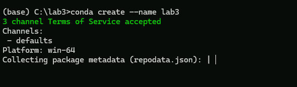
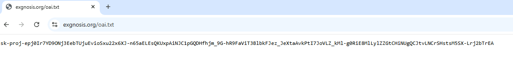
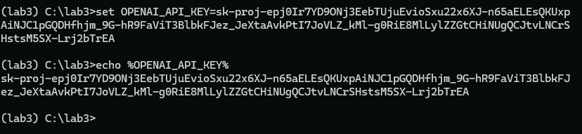
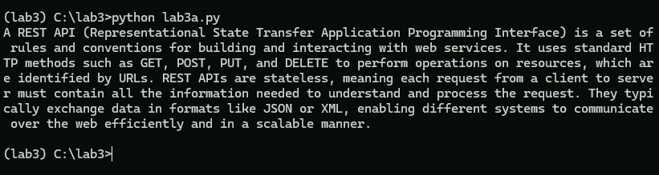
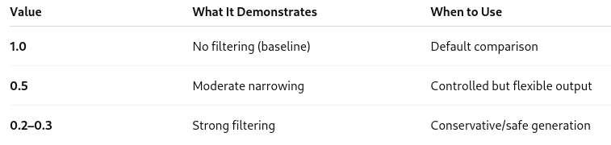

# Lab 3 - Prompt Engineering

In this lab you will experiment with temperature, top-p and maximum output settings to control the output generated by OpenAI

Note that you can't change these settings in the interactive mode, but you can change them in the API calls

## Repository

Clone the lab repository into the VM. This is so you can cut and past the Python programs without having to type them in an IDE. You will be asked to modify the programs at various points in the lab, but you can even do this in notepad or another text editor.

Visual Studio code is installws, but you may want to add the Python extension to make the Python code more readable.

**Do not run the examples from Visual Studio code, the builtin terminal does not use the configured conda environment**

## Conda Setup

Open a conda terminal from the icon on the taskbar.

Create a directory to store your work in, in this case, we are using c:\lab3.

Create a new conda environment where you will install the OpenAI API and then activate the environment. In these examples, we are calling it `lab3`

```bash
conda create --name lab3
conda activate lab3
```



Once you have activated the environment, install `pip` and the `openai` API

```bash
conda install pip
pip install openai
```

Once you have done this, confirm that `openai` is installed

```bash
pip list
```


## Using the AI Key

You need to supply an API key to use OpenAI. This key cannot be included in the repository since the security scans for GitHub won't allow it.

Instead, you can find it at the url `https://exgnosis.org/oai.txt`  Open this url in a browser _in the VM_ otherwise you won't be able to copy and paste it.

Copy the key to the clipboard. 

This key will be invalidated at the end of today's class.



In the conda shell, set the environment variable `OPENAI_API_KEY` to this value as shown. If you open a different shell, you will have to recreate this environment variable in the new shell. Print out the value to be sure you set it correctly.

```bash
set OPENAI_API_KEY=sk.....
echo %OPENAI_API_KEY%
```



## Run the API test

Move the script `lab3a.py` into the lab3 directory. The script shown here

```Python
# Lab 3a
# Test API

from openai import OpenAI

# Create client
client = OpenAI()

# Simple prompt
response = client.responses.create(
    model="gpt-4.1-mini",
    input="Explain what a REST API is in one paragraph."
)

print(response.output_text)
```

At the console, run the script as shown and confirm the output.



Once this is done, you are ready to continue with the lab

## Temperature


Recall from the lectures that the temperature determines the amount of "creativity" in the response.

The following script, `lab4b.py` allows you to experiment with working at different temperatures


```Python
from openai import OpenAI

# Create client
client = OpenAI()

prompt= "Write a surreal dream-like paragraph about a city made of glass."

response = client.responses.create(
    model="gpt-4.1-mini",
    input=prompt,
    temperature=0
)

print(response.output_text)
```

Run this script the same way you did the previous. Experiment with different values of temperature.  Temperature can range from 0 to 2. Experiment with settings like:

- 0.0	Predictable, safe
- 0.7	Balanced
- 1.2	Creative, marketing style

If you try with a temperature of 2, you will probably get gibberish.


You can also run the following script `lab3c` to see a comparison of output at different temperatures.

```Python
from openai import OpenAI

# Create client
client = OpenAI()

prompt = "Invent a completely new programming language and describe its philosophy."
for temp in [0.0, 0.5, 1.0, 1.5]:
    response = client.responses.create(
        model="gpt-4.1-mini",
        input=prompt,
        temperature=temp,
        max_output_tokens=200
    )
    print(f"\n--- Temperature: {temp} ---")
    print(response.output_text)
```

## Working with top-p

Recall from the lectures that 
- Lower top_p → narrow vocabulary choice
- Higher top_p → broader vocabulary

In practice, most production systems tune either temperature OR top_p, not both aggressively.

Just like you did with temperature, run the following script `lab3d.py` with different values of `top-p`

Ranges for top-p: 0.0 ≤ top_p ≤ 1.0
- 1.0 → no nucleus filtering (default behavior)
- Lower values → narrower probability mass selection
- Very low values → highly constrained output


```Python
from openai import OpenAI

# Create client
client = OpenAI()

prompt= "Write a surreal dream-like paragraph about a city made of glass."

response = client.responses.create(
    model="gpt-4.1-mini",
    input=prompt,
    temperature=0.8,
    top_p=0.3  # Try 0.3 vs 1.0
    
)

print(response.output_text)

```



## MAX tokens

We can also constrain output with the max tokens.  To see this, run `lab3c.py` with different values of max tokens. Try values like 50, 100 and 400

```Python
from openai import OpenAI

# Create client
client = OpenAI()

prompt = "Invent a completely new programming language and describe its philosophy."
for temp in [0.0, 0.5, 1.0, 1.5]:
    response = client.responses.create(
        model="gpt-4.1-mini",
        input=prompt,
        temperature=temp,
        max_output_tokens=120
    )
    print(f"\n--- Temperature: {temp} ---")
    print(response.output_text)
```

## Challenge 

Modify one of the scripts to do the following:

Prompt: "Write a 3-paragraph science fiction story.

Use the following parameters

- temperature=1.0
- top_p=0.9
- max_output_tokens=60

Then change:

temperature=0.1

And compare the output.

## Structured output

In this script, we specify in the prompt how we want the output to look and the data integrity constraints for the output

```python
from openai import OpenAI
import json

client = OpenAI()

prompt = """

"List all Canadian provinces and their current population."
Return a JSON object with this structure:

{
  "provinces": [
    {
      "name": "string",
      "population": integer
    }
  ]
}

Constraints:
- population must be a numeric integer
- no additional fields
- only valid JSON output
- no explanations
"""

response = client.chat.completions.create(
    model="gpt-4o-mini",
    messages=[{"role": "user", "content": prompt}],
    temperature=0.2
)

print(response.choices[0].message.content)

```

Run the script and confirm that the output is properly structured


## End Lab